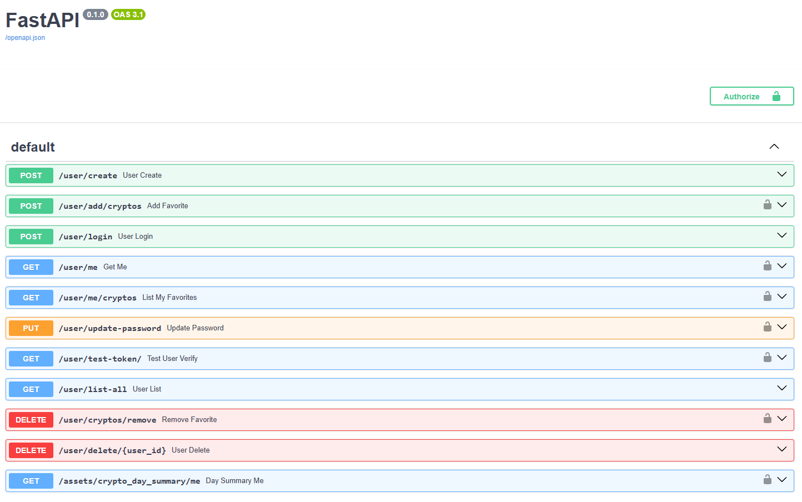

# 📈 FastAPI Crypto Asset Tracker

Este é um projeto de backend robusto desenvolvido em Python utilizando **FastAPI**. O sistema implementa **autenticação JWT** e rastreamento assíncrono de dados de ativos digitais. Usuários autenticados podem monitorar os preços históricos e diários de seus ativos favoritos, integrando-se a uma API de mercado de criptomoedas (Mercado Bitcoin).

Este projeto serve como um template para entender a integração entre:

* **FastAPI**
* **SQLAlchemy Assíncrono (AsyncSession)**
* **Chamadas de rede paralelas usando asyncio.gather**

---

## ⚙️ Tecnologias Utilizadas

* **Framework:** FastAPI
* **Banco de Dados:** PostgreSQL (via `DATABASE_URL`)
* **ORM:** SQLAlchemy (Assíncrono: `AsyncSession` + `asyncpg`)
* **Validação:** Pydantic
* **Autenticação:** JWT (`python-jose`)
* **Requisições HTTP:** aiohttp (assíncronas)
* **Criptografia:** passlib (senhas)
* **Configuração de Ambiente:** dotenv

---

## 🚀 Principais Recursos da API

* **Autenticação JWT:** Login e verificação de tokens assíncronos e seguros.
* **Persistência Assíncrona:** Uso de `AsyncSession` para evitar bloqueio do event loop.
* **Gerenciamento de Usuários:** Criação, exclusão e listagem de usuários.
* **Gestão de Favoritos:** Adição e remoção de ativos favoritos por usuário.
* **Monitoramento de Ativos:**

  * **Resumo Diário:** Busca assíncrona dos valores mais altos e mais baixos do dia anterior para todos os ativos favoritos de um usuário.

---

## 💡 Primeiros Passos

### Pré-requisitos

* Python 3.8+
* PostgreSQL rodando e acessível

### 1. Clonar o Repositório

```bash
git clone <URL_DO_REPOSITORIO>
cd <NOME_DO_PROJETO>
```

### 2. Instalar Dependências

```bash
pip install -r requirements.txt
```

### 3. Configurar Variáveis de Ambiente

Crie um arquivo `.env` na raiz do projeto com as seguintes variáveis:

```env
SECRET_KEY="SUA_CHAVE_SECRETA_ALEATORIA_E_LONGA"
ALGORITHM="HS256"
DATABASE_URL="sua_url_de_conexao_postgres"
```

### 4. Criar e Executar Migrações

Se estiver usando **Alembic**:

* Criar a migração inicial:

```bash
alembic revision --autogenerate -m "Migração inicial de users e favorites"
```

* Aplicar migrações:

```bash
alembic upgrade head
```

### 5. Executar a API

```bash
uvicorn main:app --reload
```

A API estará disponível em: [http://127.0.0.1:8000](http://127.0.0.1:8000)

---

## 📚 Documentação Interativa

O FastAPI gera documentação interativa automaticamente:

* **Swagger UI:** [http://127.0.0.1:8000/docs](http://127.0.0.1:8000/docs)


